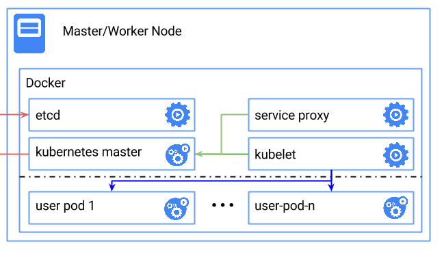

Running kubernetes locally via Docker
-------------------------------------

**Table of Contents**

- [Overview](#overview)
- [Prerequisites](#prerequisites)
- [Step One: Run k8s-docker.sh](#step-one-run-k8s-dockersh)
- [Step Two: Get kubectl](#step-two-get-kubectl)
- [Step Three: Enable addons](#step-three-enable-addons)
- [Test it out](#test-it-out)
- [Run an application](#run-an-application)
- [Expose it as a service:](#expose-it-as-a-service)

### Overview

The following instructions show you how to set up a simple, single node kubernetes cluster using Docker.
This differs from the official kubernetes docker instructions in that it supports the kube-ui and skydns addons.

Here's a diagram of what the final result will look like:


### Prerequisites
1. You need to have docker installed on one machine (either natively on linux, or via [boot2docker](http://boot2docker.io/)).

### Step One: Run k8s-docker.sh
- You may want to change the variables in the top of the file first. Most users will not need to do this.
- This may take some time to complete.

```sh
./k8s-docker.sh
```

*Note:*
On OS/X you will need to set up port forwarding via ssh:
```sh
boot2docker ssh -L8080:localhost:8080
```

### Step Two: Get kubectl
At this point you should have a running kubernetes cluster.  You can test this by downloading the kubectl binary
([OS X](https://storage.googleapis.com/kubernetes-release/release/v0.21.2/bin/darwin/amd64/kubectl))
([linux](https://storage.googleapis.com/kubernetes-release/release/v0.21.2/bin/linux/amd64/kubectl))

### Step Three: Enable addons
- This enables kube-ui and skydns
- You may need to modify skydns-rc.yaml so that it has a correct master ip address on the line that looks like: `- -kube_master_url=http://172.17.42.1:8080`

```sh
kubectl create --namespace=kube-system -f kube-ui-rc.yaml
kubectl create --namespace=kube-system -f kube-ui-svc.yaml
kubectl create --namespace=kube-system -f skydns-rc.yaml
kubectl create --namespace=kube-system -f skydns-svc.yaml
```

You can test out dns by doing the following:
```sh
kubectl create -f busybox.yaml
kubectl exec busybox -- nslookup kubernetes
```

Which should print:
```
Server:    10.0.0.10
Address 1: 10.0.0.10

Name:      kubernetes
Address 1: 10.0.0.1
```

You can get to kube-ui at [http://localhost:8080/ui](http://localhost:8080/ui).

### Test it out

List the nodes in your cluster by running::

```sh
kubectl get nodes
```

This should print:
```
NAME        LABELS                             STATUS
127.0.0.1   kubernetes.io/hostname=127.0.0.1   Ready
```

If you are running different kubernetes clusters, you may need to specify ```-s http://localhost:8080``` to select the local cluster.

### Run an application
```sh
kubectl -s http://localhost:8080 run-container nginx --image=nginx --port=80
```

now run ```docker ps``` you should see nginx running.  You may need to wait a few minutes for the image to get pulled.

### Expose it as a service:
```sh
kubectl expose rc nginx --port=80
```

This should print:
```
NAME      LABELS    SELECTOR              IP          PORT(S)
nginx     <none>    run=nginx             <ip-addr>   80/TCP
```

Hit the webserver:
```sh
curl <insert-ip-from-above-here>
```

Note that you will need run this curl command on your boot2docker VM if you are running on OS X.
